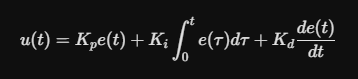
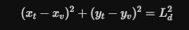
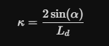
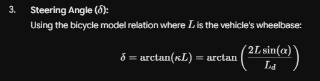
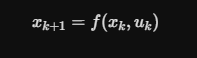
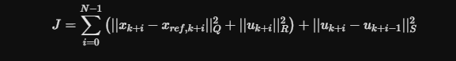
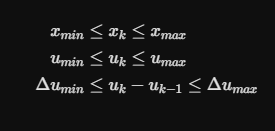
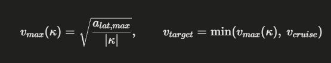

Name : Eyad Mohamed Fouad Abdelrahman Mohamed Salem
Number : 01140522270
Email : eyads0lem@gmail.com

--Brief Overview about this project--
It's a ROS2 simulation of a small self-driving car that has to drive around a closed racetrack bounded by cones that it must avoid. The car doesn't recieve direct velocity inputs , but it moves based on different states along with some other inputs. The reason for this design , is that it give us a closer view of how cars/vehicles in general operate with all the disturbances/noises it faces.In this project, the main focus was on three primary controllers MPC , PID and Pure pursuit.It also includes a curvature-based velocity profiler , and a lap analyzer that measures the benchmarks/performance of each controller so we can compare them at the end and know the best one "in this scenario" as each scenario/case can have a different controller that coupes better.

--System Architecture--
This project includes three main packages:-
    * bicycle_sim --> Includes the vehicle model in bicycle_model.py , and the kinematic_bicycle has the robot discription alon with the RVIZ configs and the main launch file.

    * bicycle_control --> The controller node which has the main nodes this projects provides 

    * track_environment --> It provides the path and the boundary cones.Plus , it runs the lap analyzer which is needed to compare the performances.

    :- We also have publishers and subscribers that talk to each other through a topic which has a type and parameters to adjust. For example : /throttle , /steer , /state , /path , /cmd_vel etc... there are too much.

--Mathematical Formulas & Concept of each controller--

PID --> It's divided into three parts : P (proportional) which reacts to the current error if it's large then it takes a large correction and vice versa. I (Integeration) which keeps up with the past errors to avoid steady state which won't allow the control to reach the desired target. D (Derivative) this one checks the rate of change so if the controller is increasing it's speed rapidly to reach a target the D slows it down to prevent overshoot(is when you exceed the desired goal)

Formula & some of it's variables -->   
U(t) = is the output
e(t) = is the error at time t
kp , ki , kd = are the gains for each part

Pure pursuit --> It's a geometric path-tracking algorithm as it's concept is trying to chase a taget point located at a fixed distance ahead along the reference path. This distance is known as the lookahead distance. Using some way (using geomtry to calculate the curvature needed to smoothly arc the vehicle toward the target point) which is something that makes it highly stable at moderate speeds.

Formulas -->  this is to get the lookahead distance from the vehicle's current position.Then we got the path curvature equation which leads us to the target point . The a indicates the angle between the vehicl's current heading vector and the vectore pointing from the vehicle to the lookahead target.
Most importantly, the steering angle for formula .

MPC --> It's a more advanced controller , optimization-based control strategy that is mostly used in autonomous racing and robotics. It uses a mathematical model of the vehicle to predict future behavior over a defined time window known as prediction horizon(N).At every time step, MPC solves an optimization problem to get the optimal sequence of control inputs that minimizes a cost function. A cost functions contains the errors/disturbances that might affect the car in a very crucial way or just barely. This type of distrubances whether they are heavy or not are upon something called weighting the error. When the mpc predicts future steps , it then takes the first control command in the sequence and then the optimization is resolved at the next time step in a receding horizon way.

Formulas -->  so the future prediction depends on the current state and some other factors. Then we got the cost function known as (J) , we usually square errors so we get rid of very tiny errors that won't really bother in the overall performance. In addition to that , what makes MPC a great choice is that it also takes vehicle constraints inconsideration  which means that the vehicle won't do an out of bound control.

Also we got "Velocity profiler" which is used to know the speed limit in corners from lateral acceleration. There is always limit in corners because many issue might happen if we don't get vehicle constraints or even turn sharply on high speed. The fourmuala  k basically indicates whether the path is smooth or not if it's zero then it's like a checkpoint that the car's speed can reach max speed since it's a straight path.

--- Quick Brief about each topic MILESTONE 6 --

- 3D Simulation (Gazebo or MVsim) :- Starting off with Gazebo , it's a 3D simulator that creates like a virtual sandbox where a robot can move and behave according to physics.Which basically allows you to test your algorithms without needing real hardware ,which saves time , money and prevents damage. Gazebo runs as a client-server system. Server(gzserver) which is the brain, it runs the physics engine ,simulates sensors and calculates where everything is. Client(gzclient) the eyes, which is the graphical window you see on the screen. Server / Client are connects and ROS2 code aswell so they can all communicate. What about MVSIM , it's a lighter and a faster simulater that focuses on vehicles. Also , it uses a 2D physics engine , but adds realisteic vehicle dynamics into it. It works entirely through XML files , so you can change the environment/world without writing code.
-Couple instructions to know how gazebo works:- 

    To build a robot  : Create a URDF file that contains links and joins
    To Add some physics : Convert to SDF or add the tags like mass , friction or even sensors
    To build the world : Write an SDF file that has the grouns , walls and maybe lighting
    Now to Launch : Use the ordinary ROS2 launch file to start gazebo and spawn the robot

- Nav2 MPPI Control :- MPPI (Model predictive path integral) which uses the same algorithm as the mpc with some difference in the way of finding the optimal solutions.This controller that takes a global path and live sensor data , then calculate the speed commands to make the robot follow that path while making sure to avoid any obstacles. The way this controller finds the optimal path is by guessing or let's say by sampling throwing nodes in random spots and just connecting the dots which allows it to make plenty of possible paths. Then it uses the robot's motion model to simulate where each path would lead over a short time and each path is evaluated using a cost function just like the normal MPC it also evaluates using cost functions. After that , a computed weighted average of all paths is calculated so the path that has a lower cost get's a higher weight which indicates that that path actually dodges obstacles, follows path and meet the requirements then the average becomes the new command. The reason behind people using MPPI nowadays is that it handles non-linear robot motion fairly well , plus it doesn't need complex math calculations like getting the gradient decent or any complex calculations in general. In addition to that , it works very smooth in tight spaces with many obstacles since it like has a future vision of the path so it prepares the vehicle well before facing any obstacles , corners etc...

- Four-Wheel Ackermann :- it's basically a geometry used in most cars. When a vehicle turns , the inner wheel turns at a sharper angle that the outer wheel. This is because the inner wheel travels a smaller circle. Without this geomtry there is a very high chance that the wheels would slip and drag.This is an example for better understanding :- Let's say the car is turning left therfore the left (inner) front wheel travels smaller circle while the right (outer) front wheel travels a bigger circle this also implies on the rear wheels since they also travelled different-sized circles. There is something called ICR ( Instantaneous Centre of Rotation) which is something all four wheels must share as it's the common turning centre among all wheels. Plus, since the rear wheels don't steer only the front ones so this centre lies on the line of the rear axle. Simply the point is trying to make the front wheels point exactly towards that centre therefore the inner front wheel turns at a bigger angle while the outer turns at a smaller angle. Someone might think that this contradicts by saying at the beginning travels a smaller circle while in the previous statement it said that the inner fron turns at a bigger angle. To clarify this point of possible confusion , when traveling a smaller circle it requires a bigger steering ange therefore for the outer to travel a bigger circle it requires a smaller angle.

--More Details About the Nav2 MPPI Control--
    Usually in traditional optimal control , fidning the best control sequence requires solving a tough nonlinear partial differntial equation called the HJB equation back then. This was very complex and took too much effort (computation/time).Since we got MPPI now it uses an exponential transformation. This allows it to linearize the nonlinear HJB partial differntial equation , but ofcourse as a path integeral which means an expectation over forward-simulated paths.The MPPI isn't just like random sampling , but also it comes from an information-theoretic optimal control framework. It frames optimal control as a KL divergence minimization problem between uncontrolled and a controlled system. By doing this , it changed computing the optimal control input using heavy mathematical optimization solver into Monte Carlo estamtion of an expeceted value using importance sampling. Something very important is that the stochastic noise variance injected into the system must match the control weight. Meaning that , it directly shows how aggressive the alorithm weights low cost paths versus high cost path during the weighting average process.

    -- BenchMarks & Comparison -- 

    

    To begin with the aim is a fair speed with low CTE - Cross Track Error to make sure that the vehicles respect the lane it's driving through and doesn't keep getting out of bounds.
    As shown the MPC has the best lap time along with the highest speed by a fairly good difference , but comparing the CTEs it would hold the second place after the pure pursuit. After these two , the PID shows up it's not too bad but it's not too quick or even maintaining the track boundaries correctly so it won't really be the perfect option here. Finally , the manual control it shouldn't even be on the list as it's results are way too off from the optimal results needed therefore it's not reliable by any means.

    --Steps to run the code--
        -colcon build --symlink-install
        -source install/setup.bash
        -Now if the code has no errors everything should run smoothly
    --These are the commands so you can run each controller--
    ros2 launch bicycle_sim bicycle_sim.launch.py controller:=teleop -> In a second terminal run-> ros2 run teleop_twist_keyboard teleop_twist_keyboard -> so your inputs can read and control the vehicle
    ros2 launch bicycle_sim bicycle_sim.launch.py controller:=lateral_pid
    ros2 launch bicycle_sim bicycle_sim.launch.py controller:=pure_pursuit
    ros2 launch bicycle_sim bicycle_sim.launch.py controller:=mpc
    --Now to check the graphs--
    you can use rqt_plot to check the errors relative to the time or even rqt_graph to checks the nodes , topics and which ones are the subscriber or publisher

    --Showing Laps--

    MPC--> 

        

    lateral_pid-->

        

    
    pure_pursuit-->

        

    Manual_control-->

        

